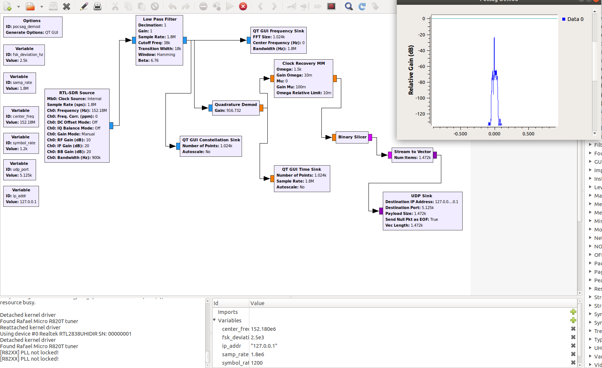

# gr-pocsag-decoder

> Demodulator and decoder for POCSAG pagers using GNU Radio and Python

GNU Radio program and Python module to demodulate and decode POCSAG signals. There are 2 portions of the project: the GNU Radio Companion (GRC) flow graph for converting the POCSAG signal to a bit stream and the python module to read the bit stream and convert it to an ASCII or BCD message. The Python module does not depend on any external libraries and is currently compatible with Python2.7, with Python3 integration coming soon.

The motivation behind this project is to demonstrate 2 things. First being that the devices we use to talk everyday aren't (completely) magic. Second being that when using these devices we have to consider the security implications and know that what we send through them may not be private.

> Side note: I'm currently working on a project to estimate the amount of HIPPA violations sent through unsecured POCSAG channels (it's a lot).



## Setup

### Getting Code

Just clone the repository and make sure Python and GNU Radio are installed on your system.

```sh
git clone git@github.com:Kdoggett887/gr-pocsag-decoder.git
cd gr-pocsag-decoder
```

### Configure GRC Flow Graph

There are a few variables that you will likely need to configure in the GRC flow graph. These involve tuning your SDR and specifying the baud rate for your local POCSAG system. All the GRC variables are listed below:

#### fsk_deviation_hz

Default: 2.5 kHz

POCSAG uses 2-FSK modulation, so a frequency shift on the carrier must be specified. The documentation specifies a 4.5 kHz shift, but American systems use a 2.5 kHz shift per FCC requirements.

#### samp_rate

Default: 1.8 MHz

Sample rate of the SDR you are using. I use RTL-SDR and 1.8 MHz is the default in `gqrx` so I kept it at that.

#### center_freq

Default: 152.18 MHz

The center frequency of the SDR. This will be the frequency of the POCSAG channel you are looking to demodulate +/- some offset from defects in your radio, interference, randomness, etc. I recommend using a program like `gqrx` to help you find this exact number after looking online for what your local POCSAG channels are.

#### symbol_rate

Default: 1200 Bd

The rate that the target POCSAG signal transmits symbols. Standard rates are 600, 1200, and 2400 Bd.

#### udp_port

Default: 5125

The port where the udp sink will stream data.

#### ip_addr

Default: 127.0.0.1 (localhost)

The ip address where the udp sink will stream data.

### Python Module

Currently, the python module does not accept cmd line args. That is coming soon though. For now, it by default listens for data from a UDP port, but you can edit the `python/pocsag_reader.py` file and change `FILE_NAME` and `FROM_FILE` to the path of a file containing encoded bits and `True`, respectively.

## Usage

After configuring the GRC flow graph, click the run button to get it going. It will display a UI with the time series graph of the demodulated 2-FSK signal, the spectrum coming through the low-pass filter, and the 2-FSK constellation diagram, which is a circle where a bigger radius indicates a stronger signal.

To start the decoder, just use the following command:

```sh
python python/pocsag_reader.py
```

The messages and other debugging information will be displayed in the console.

## Future Improvements

- Replace `print` statements with `logging.log` statements to make it compatible across Python2 and Python3.
- Add command line arguments (logging level, udp socket or file source, port and ip address, ASCII or BCD output, output to file or console).
- Add support for other encoding types (Manchester encoding, etc).
- Turn Python module into OOT module for GNU Radio?
- Multithreading on the Python module to guarantee we won't miss a packet sent from GRC (hasn't been an issue yet, but it's definitely a possibility).
- Add reference docs to README.

## License

Distributed under the GPL-3.0 license. See `LICENSE` for more information.

## Contributing

1. Fork it (<https://github.com/Kdoggett887/gr-pocsag-decoder/fork>)
2. Create your feature branch (`git checkout -b feature/fooBar`)
3. Commit your changes (`git commit -am 'Add some fooBar'`)
4. Push to the branch (`git push origin feature/fooBar`)
5. Create a new Pull Request
